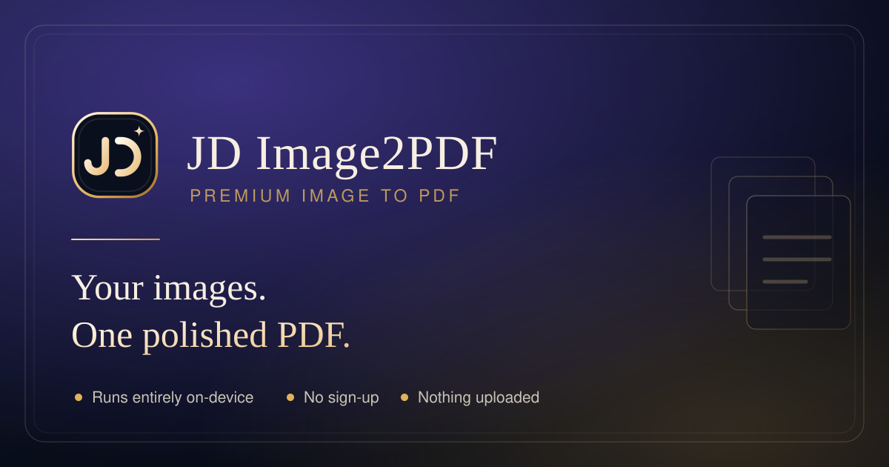

# JD Image2PDF

A premium, **fully on-device** image-to-PDF converter. Drop in your images, arrange
them, dial in the layout, and download a polished PDF — with nothing ever leaving
the browser.



---

## Why it's different

- **100% local.** Decoding, rotation, encoding and PDF assembly all run in your
  browser via `Canvas` + jsPDF. There is no upload endpoint, no server round-trip
  and no analytics.
- **No sign-up, no limits beyond your patience.** Drop a folder of 300 images or
  paste from the clipboard.
- **Per-page control.** Any page can override the document's paper size,
  orientation and fit mode independently.
- **Password protection.** Optional AES encryption with granular permissions
  (print / copy / modify / annotate).

## Features

| Area | What you get |
| --- | --- |
| Input | File picker, folder picker, drag & drop, clipboard paste |
| Formats | PNG, JPEG, WebP, GIF, AVIF, BMP — anything the browser can decode |
| Arrange | Drag to reorder, `Alt + ←/→` nudge, rotate, duplicate, delete |
| Paper | A4, Letter, Legal, A3, A5, B5, Tabloid, Square, or **match image** |
| Fit | Contain (letterbox), Cover (fill & crop), Stretch |
| Margins | 0–40 mm, applied uniformly |
| Resolution | Uncapped, or cap at 96 / 150 / 300 / 600 DPI |
| Quality | 40–100% JPEG quality |
| Footer | Custom text + `1`, `1 of N` or `Page N`, left / center / right aligned |
| Metadata | Title, author, subject, keywords |
| Security | Optional password + permission flags |
| Output | Custom filename, re-download any time |

## Quick start

```bash
npm install     # only needed to re-vendor jsPDF or run the tests
npm start       # serves http://localhost:5173
```

The app is a plain static site — any static host works. There is **no build step**
and no framework.

```
index.html
assets/
  css/styles.css
  js/app.js          UI controller
  js/store.js        page + settings state
  js/pdf-engine.js   geometry, encoding, PDF assembly
  img/               logo, favicon, OG image
vendor/jspdf.umd.min.js
```

`vendor/jspdf.umd.min.js` is committed on purpose, so the converter works with no
network access. Refresh it with:

```bash
npm run vendor
```

## Tests

```bash
npm test          # 54 geometry unit tests (paper sizes, rotation, fit, DPI, encryption)
npm run test:e2e  # full browser run: ingest -> edit -> 6 PDF builds -> structural checks
npm run verify    # both
```

Both suites drive a real headless Chrome, so start the server first:

```bash
npm run serve &
npm run verify
```

The end-to-end suite writes screenshots and the generated PDFs to `tmp-verify/`.

## Browser support

Current Chrome, Edge, Firefox and Safari. Modern browsers are required because
the converter relies on `createImageBitmap`, OffscreenCanvas-era canvas encoding
and ES modules.

## Privacy

No network requests are made after the page loads. Web fonts are the only optional
external request and the app falls back to system fonts without them.

## License

MIT
